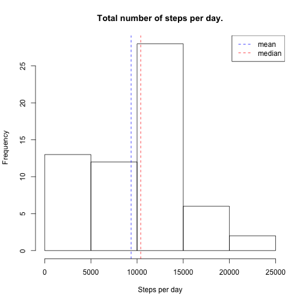
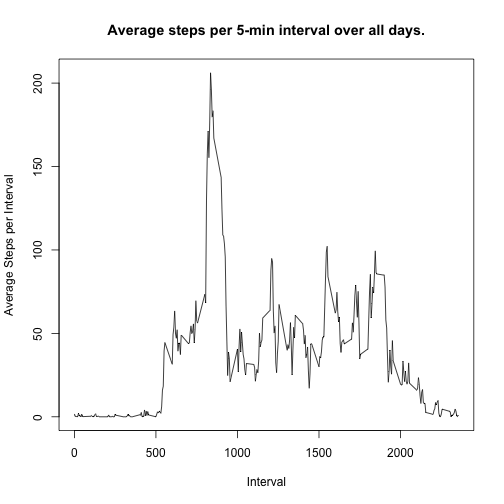
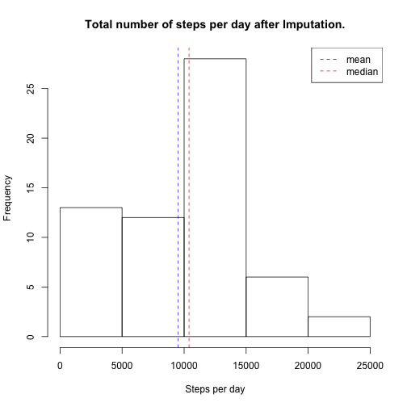
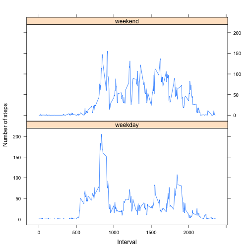

```r
options(digits=4)
```

## Loading and preprocessing the data
The first step is to load and explore the data set. The data set is contained in a single CSV file, "activity.csv", delivered as a zipped file "activity.zip", containing a single file, "activity.csv".

It is instructive to then examine the structure of the dataset, and the first and last few rows.


```r
# Read raw data
unzip("./activity.zip")
activity <- read.csv("./activity.csv", colClasses=c("integer", "POSIXct", "integer"))

# Structure of the raw data
str(activity)
```

```
## 'data.frame':	17568 obs. of  3 variables:
##  $ steps   : int  NA NA NA NA NA NA NA NA NA NA ...
##  $ date    : POSIXct, format: "2012-10-01" "2012-10-01" ...
##  $ interval: int  0 5 10 15 20 25 30 35 40 45 ...
```

```r
# First and last 6 records
head(activity)
```

```
##   steps       date interval
## 1    NA 2012-10-01        0
## 2    NA 2012-10-01        5
## 3    NA 2012-10-01       10
## 4    NA 2012-10-01       15
## 5    NA 2012-10-01       20
## 6    NA 2012-10-01       25
```

```r
tail(activity)
```

```
##       steps       date interval
## 17563    NA 2012-11-30     2330
## 17564    NA 2012-11-30     2335
## 17565    NA 2012-11-30     2340
## 17566    NA 2012-11-30     2345
## 17567    NA 2012-11-30     2350
## 17568    NA 2012-11-30     2355
```

As shown in the output above, the data set consists of 17568 observations of only 3 variables:

- steps:    Number of steps taken in a given 5-minute interval.
- date:     Date at which the measurement was taken in yyyy-MM-dd format.
- interval: which 5 minute interval the measurement was taken in.

One can see that there are a significant number of observations with missing values for the "steps" variable.

## What is mean total number of steps taken per day?


```r
suppressMessages(library("dplyr"))

# Calculate Total Steps per day
steps_per_day <- activity %>% 
                    group_by(date) %>%
                    summarize(steps_per_day=sum(steps, na.rm=T)) %>%
                    select(date, steps_per_day)

# Calculate Mean and Median
spd_mean <- mean(steps_per_day$steps_per_day)
spd_median <- median(steps_per_day$steps_per_day)
```
Below is a histogram of the number of steps per day.


```r
# Histogram of steps per day
hist(steps_per_day$steps_per_day, xlab="Steps per day", main="Total number of steps per day.")
abline(v=spd_mean, lty=2, col="blue")
abline(v=spd_median, lty=2, col="red")
legend("topright", legend=c("mean", "median"), lty=2, col=c("blue", "red"))
```

 

The average number of steps taken per day is 9354.2295, while the median is 10395. 

## What is the average daily activity pattern?


```r
average_by_5min <- activity %>%
                    group_by(interval) %>%
                    summarize(avg_steps=mean(steps, na.rm=T))

plot(average_by_5min$avg_steps ~ average_by_5min$interval, type="l", xlab="Interval", ylab="Average Steps per Interval", main="Average steps per 5-min interval over all days.")
```

 


```r
top_5min_interval <- average_by_5min[average_by_5min$avg_steps==max(average_by_5min$avg_steps, na.rm=T),]$interval

top_5min_interval
```

```
## [1] 835
```

The interval with the highest average number of steps across all days is 835

## Imputing missing values

The first step is to calculate the total number of observations with missing values for the "steps" variable:


```r
count.na <- count(activity[is.na(activity$steps),])
count.na
```

```
## Source: local data frame [1 x 1]
## 
##       n
##   (int)
## 1  2304
```

Total number of observations with missing step counts: 2304, or 13.1148% of all observations.

Missing values are next filled in for a given interval on a given day by using instead the median value for that interval across all days.


```r
suppressMessages(library(dplyr))

# calculate median steps across all days for all intervals
median_by_5min <- activity %>%
                    group_by(interval) %>%
                    summarize(mdn_steps=median(steps, na.rm=T))

# merge the median into the main dataset.
activity_with_intervalmdn <- merge(activity, median_by_5min, by="interval", all.x=T, all.y=F)

# replace NAs with median
activity_with_intervalmdn[is.na(activity_with_intervalmdn$steps), ]$steps <-
  activity_with_intervalmdn[is.na(activity_with_intervalmdn$steps), ]$mdn_steps

# remove unwanted columns.
activity_imputed <- activity_with_intervalmdn %>% 
                      select(date, interval, steps)
```

Here is the structure of the new dataset, with missing values impured as discussed above, as well as its first and last few records:


```r
str(activity_imputed)
```

```
## 'data.frame':	17568 obs. of  3 variables:
##  $ date    : POSIXct, format: "2012-10-01" "2012-11-23" ...
##  $ interval: int  0 0 0 0 0 0 0 0 0 0 ...
##  $ steps   : int  0 0 0 0 0 0 0 0 0 0 ...
```

```r
head(activity_imputed)
```

```
##         date interval steps
## 1 2012-10-01        0     0
## 2 2012-11-23        0     0
## 3 2012-10-28        0     0
## 4 2012-11-06        0     0
## 5 2012-11-24        0     0
## 6 2012-11-15        0     0
```

```r
tail(activity_imputed)
```

```
##             date interval steps
## 17563 2012-10-16     2355     0
## 17564 2012-10-07     2355     0
## 17565 2012-10-25     2355     0
## 17566 2012-11-03     2355     0
## 17567 2012-10-08     2355     0
## 17568 2012-11-30     2355     0
```

Next we recalculate and display the total, median and mean number of steps per day, but this time using the dataset with missing values imputed.


```r
# Calculate the total number of steps per day using the imputed values.
steps_per_day_with_imputation <- activity_imputed %>% 
                    group_by(date) %>%
                    summarize(steps_per_day=sum(steps, na.rm=T)) %>%
                    select(date, steps_per_day)

# Calculate Mean and Median of steps per day with imputation.
spd_mean_with_imputation <- mean(steps_per_day_with_imputation$steps_per_day)
spd_median_with_imputation <- median(steps_per_day_with_imputation$steps_per_day)
```

The histogram as above, but after missing values are imputed.


```r
# Histogram of steps per day
hist(steps_per_day_with_imputation$steps_per_day, xlab="Steps per day", main="Total number of steps per day after Imputation.")
abline(v=spd_mean_with_imputation, lty=2, col="blue")
abline(v=spd_median_with_imputation, lty=2, col="red")
legend("topright", legend=c("mean", "median"), lty=2, col=c("blue", "red"))
```

 


The average number of steps per day after imputation of missing values is 9503.8689, having moved closer to the median (it was 9354.2295 before missing values were filled in). The median is still 10395. This is to be expected since we used the median value to fill in blanks.

## Are there differences in activity patterns between weekdays and weekends?

The first step is to add a column identifying whether the date for an observation corresponds to a weekday or a weekend day. The structure of the new dataset follows below:


```r
activity_imputed_with_wkday <- activity_imputed %>%
  mutate(is.weekday=factor(ifelse(weekdays(date, abbreviate=T) %in% c("Sat", "Sun"), "weekend", "weekday")))

str(activity_imputed_with_wkday)
```

```
## 'data.frame':	17568 obs. of  4 variables:
##  $ date      : POSIXct, format: "2012-10-01" "2012-11-23" ...
##  $ interval  : int  0 0 0 0 0 0 0 0 0 0 ...
##  $ steps     : int  0 0 0 0 0 0 0 0 0 0 ...
##  $ is.weekday: Factor w/ 2 levels "weekday","weekend": 1 1 2 1 2 1 2 1 1 2 ...
```

Next the average steps per interval is calculated, grouped by whether the value corresponds to a weekday or a weekend, in order to display a panel plot by day type of the relationship between interval and average number of steps.

```r
wkday_averages <- activity_imputed_with_wkday %>%
                    group_by(interval, is.weekday) %>%
                    summarize(avg_steps=mean(steps)) %>%
                    ungroup()


suppressWarnings(library(lattice))

with(wkday_averages, 
     xyplot(avg_steps ~ interval | is.weekday, panel=panel.lines, layout=c(1, 2), ylab="Number of steps", xlab="Interval"))
```

 
